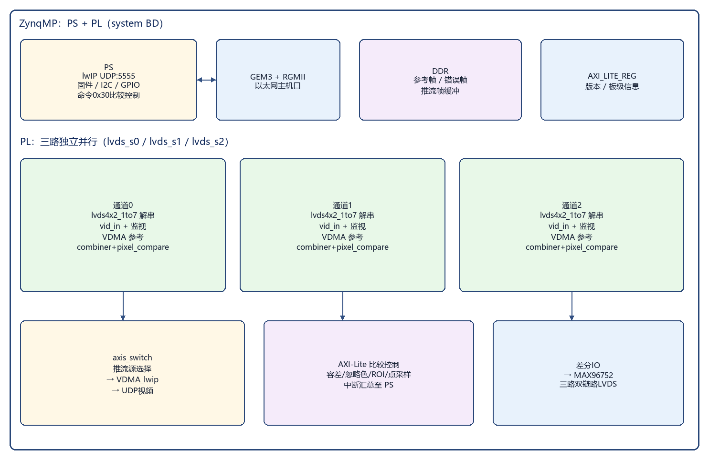
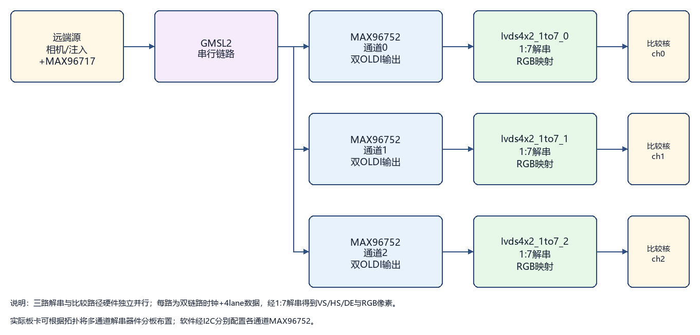
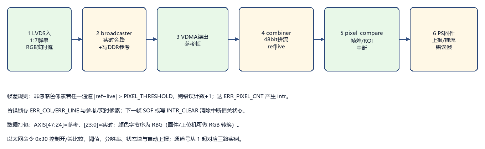

产品技术交底书

一、机构或装置的名称：

3 通道 LVDS 图像输入比较装置
（亦可命名为：三路 OLDI/LVDS 视频采集与帧差比较卡、基于 ZynqMP 的 CCU 多通道 LVDS 图像比对装置、以太网控制的三路解串图像比较系统）

二、现有技术及其不足：

当前车载显示、座舱电子、影像链路验证及产线 EOL 测试等场景中，对多路串行解串后的 LVDS/OLDI 图像进行一致性比对，已有若干种技术方案，主要包括以下几类：

基于 PC 工控机 + 采集卡的离线比对方案
将相机或解串器输出的视频经专用采集卡送入工控主机，由上位机软件在内存中逐帧做差分、ROI 统计与报表。
常用形态：PCIe 采集卡 + 离线分析软件、录像回放比对工具等。

基于纯软件帧缓存比对的嵌入式方案
在通用处理器（ARM/DSP）上通过 DMA 或驱动缓存两路/多路图像，由 CPU 逐像素比较。
常见组合：SoC + 外部 SerDes + 软件差分库。

基于 FPGA 的单通道或时分复用比对方案
在 FPGA 内对一路实时流与参考流比较，或通过多路复用开关分时切入同一比较核。
常见组合：单链路 LVDS 接收 + 帧缓冲 + 简单阈值比较。

现有技术不足：

主机依赖重、实时性差：PC 采集 + 离线比对难以满足产线节拍与在线联调对“即收即比、超时上报”的要求；CPU 逐像素比对占用算力高，帧率与分辨率上升后易丢帧。

多通道并行能力不足：时分复用或单核切换无法同时对三路独立 LVDS 流做真并行比较；通道间时钟与相位独立时，软件同步成本高。

与 GMSL/OLDI 链路耦合弱：解串芯片（如 MAX96752）输出的双链路 OLDI/LVDS 需专用 1:7 解串与像素映射；通用采集卡或纯软件方案对接成本高、时序裕量难保障。

比较策略封闭、现场可配性差：忽略色、容差、错误像素个数阈值、ROI 目标色统计、点采样等能力分散在上位机脚本中，硬件侧缺少统一寄存器与中断上报路径。

部署与接口不统一：部分方案绑定专用机箱或厂商封闭协议；缺少普及的以太网命令口与错误帧回传，不利于与现有测试上位机集成。

扩展与维护成本高：通道数增加时常需更换整机架构；参考帧、实时帧与推流路径割裂，难以在同一板卡上完成“采集—缓存参考—帧差—推流/上报”。

三、本发明的目的：

本发明旨在提供一种 3 通道 LVDS 图像输入比较装置，使远端经 GMSL2 串行链路到达解串器后的三路独立 OLDI/LVDS 视频，可在同一 SoC-FPGA 板卡上并行接收，并与片外 DDR 中的参考帧做帧差像素比较，经以太网完成控制、状态读回与错误上报。主要目的是解决现有技术中实时性差、多通道并行不足、与解串前端耦合弱、比较策略难配置、部署不便等问题。

具体而言，本发明的目的包括：

提供便携/机柜可部署的 CCU 硬件平台：以太网主机接口 + 三路双链路 LVDS/OLDI 输入 + I2C 配置解串芯片。

以 Zynq UltraScale+ MPSoC（PS+PL）为核心：PL 完成 LVDS 1:7 解串、视频入库、参考/实时拼流与帧差比较；PS 运行 lwIP 协议栈与业务固件，无需外挂独立工控主机完成核心比对。

三路通道硬件独立并行：每路独立解串 IP、独立 VDMA 参考缓冲与独立像素比较核，避免时分复用带来的通道间互相阻塞。

支持可配置帧差策略：像素容差、忽略色、错误像素个数阈值、首错坐标/像素锁存、ROI 目标色统计、指定点采样及比较中断。

支持以太网二进制命令协议与视频推流：上位机经 UDP 配置比较参数、读写 I2C/寄存器、切换通道推流，并可按策略自动上报错误状态块。

模块化板卡划分：载板、Capture/核心数字、解串前端（MAX96752）等可按 CCU 结构分板对接，降低改版与量产成本。

四、系统功能概述

本装置经以太网与上位机连接。上位机通过带校验的二进制帧协议配置通道、阈值、ROI、忽略色等参数，并控制比较启停与推流源选择；片上 PS 固件经 AXI-Lite 访问各通道像素比较核与 VDMA，经 GPIO/I2C 复位与配置 MAX96752 等解串器件。

远端相机或注入源经 GMSL2 串行后，由 MAX96752（或同功能解串器）还原为双链路 OLDI/LVDS；FPGA PL 侧对三路独立完成 1:7 解串与 RGB 映射，将实时视频写入 DDR 参考区，并与读出的参考帧在比较核内做帧差。比较结果可产生中断与错误坐标锁存；实时视频亦可经 VDMA/lwIP 推流供监视。

本装置主要工作能力包括：
三路独立 LVDS/OLDI 接收与分辨率/帧率监测；
参考帧缓存与帧差像素比较（含忽略色与错误个数阈值）；
ROI 内目标色统计与指定点像素采样；
I2C 配置解串前端；以太网命令控制与可选错误自动上报；
通道切换显示与推流。

五、详细描述本发明的机构或装置：

3 通道 LVDS 图像输入比较装置由以太网物理层、ZynqMP SoC（含 PS 与 PL）、DDR 存储器、配置/启动存储器、电源模块、三路 LVDS/OLDI 输入接口、解串芯片（MAX96752 等）、I2C 总线、GPIO 复位与指示电路组成；可选配套远端串行芯片（MAX96717 等）构成完整 GMSL2 链路。

总体结构见图1，板卡/模块划分见图2。

图1  3通道LVDS图像输入比较装置总体结构框图

图2  载板与Capture/解串前端模块划分示意图

本发明提供的一种 3 通道 LVDS 图像输入比较装置，主要包括如下组成部分与功能模块：

（一）主机接口部分

以太网接口
采用 RJ45 + 以太网 PHY（实施例：RTL8211F 或同功能 RGMII PHY），经 ZynqMP PS 侧 GEM（实施例：GEM3 + RGMII）与上位机对接，用于命令交互、状态回读及视频推流。

以太网协议栈与命令服务
在 PS 侧运行 lwIP，默认命令端口 5555（UDP）；默认板卡 IP 可为 192.168.1.10（可配置保存）。应用层采用统一二进制帧格式（总长、命令码、参数区、累加取反校验）；失败应答以预留字节置 FF FF 指示。

（二）核心处理部分

Zynq UltraScale+ MPSoC（FPGA+ARM）
采用 Xilinx Zynq UltraScale+ 系列器件（实施例：XCZU2CG-SFVC784-1-E）。片上处理系统（PS）运行固件与网络协议；可编程逻辑（PL）完成视频解串、DMA、比较与监视。PL 内部功能模块见图3，主要包括：
三路 LVDS 接收子系统（lvds4x2_1to7）：每路双时钟链路 × 4 数据 lane，1:7 解串并映射为双像素 RGB 与 VS/HS/DE；
视频入 AXI-Stream（v_vid_in_axi4s）与通路监视（axis_passthrough_monitor：宽/高/FPS）；
每路层次子系统（lvds_s0/s1/s2）：位宽转换、FIFO、broadcaster；一路实时进比较拼流，一路经 VDMA 写入 DDR 作参考帧；
axis_combiner：将参考半字与实时半字拼为 48 bit AXI-Stream；
axis_pixel_compare：帧差比较、ROI 统计、点采样、中断输出；
顶层 axis_switch：选择推流源经 VDMA + lwIP 送出；
AXI-Lite 外设：比较核寄存器、版本寄存器、GPIO（LVDS/SerDes 复位、指示灯等）、UART/RS485 等附属接口。

图3  SoC/FPGA 内部功能模块框图

DDR 存储器
挂接于 PS/PL 共享存储子系统，用于参考帧缓冲、错误帧缓存及网络视频帧缓冲。

配置与启动
QSPI/eMMC 等启动介质存放比特流与应用镜像（按板级启动方案选择），上电加载 PL 与 PS 软件。

时钟
PL 视频与比较通路采用 PS 输出 pl_clk0（实施例约 300 MHz）；LVDS 解串侧配合 IDELAYCTRL 等与链路时钟约束（实施例差分输入周期约束约 20 ns）。

（三）图像输入与解串前端部分

解串芯片
采用 MAX96752（或同功能 GMSL2 解串器），将串行链路恢复为双链路 OLDI/LVDS 输出至 FPGA。实施例中三路通道各自对接独立解串前端或按板卡拓扑分配；固件经 I2C 下发 OLDI 相关配置表（如 max96752_oldi）。

远端串行（系统配套，可选）
远端可采用 MAX96717 等串行芯片将相机/注入源接入 GMSL2；本比较装置侧以解串接收为主。

LVDS/OLDI 接口
每通道引出双链路时钟与数据差分对（clkin0/1、datain0/1[3:0]），电平与约束按板级设计（实施例 DIFF_HSTL_I_18）。

三路独立接收链路见图4。

图4  三路独立 LVDS/OLDI 接收与比较链路示意图

I2C 与 GPIO
PL 侧 xgpio 转 I2C 等模块分别服务各通道解串器件；GPIO 用于 LVDS/SerDes 复位、锁定指示、继电器/写保护等板级控制。

（四）电源与结构部分

电源模块
多路稳压，为 SoC、DDR、PHY、解串芯片与 IO 供电。

机械结构
优选“载板 + Capture/核心板 + 解串前端板”模块化对接：载板提供电源、以太网与板间连接；Capture 板承载 ZU2CG 与 DDR；解串前端板承载 MAX96752 与 LVDS 连接器。亦可做成少分板或一体化，功能划分保持不变。

主要器件选型（实施例）：
SoC：Xilinx XCZU2CG-SFVC784-1-E；
以太网 PHY：Realtek RTL8211F（或同功能）；
解串：Maxim/ADI MAX96752；
远端串行（系统侧）：MAX96717（可选）；
存储：DDR4（容量按板级）；
系统时钟组织：PS pl_clk0 ≈ 300 MHz 驱动 PL 视频与比较通路；
工具链：Vivado / Vitis 2020.1。

六、工作方式：

本装置典型工作方式见图5；单通道帧差比较在装置内部的数据路径见图6。

图5  典型工作方式示意图

图6  单通道帧差比较数据路径（装置内部数据流）

参考帧捕获与帧差使能
上位机经以太网选定通道，配置像素容差、忽略色、ROI、错误像素个数阈值等；固件控制该通道 VDMA，将当前实时流写入 DDR 参考缓冲。使能比较后，axis_combiner 持续将参考流与实时流拼成 48 bit 数据送入 axis_pixel_compare；当流有效且比较使能时，对非忽略色像素做通道差分，超阈累计错误像素，首错锁存坐标与参考/实时像素值；达到错误个数阈值产生中断，固件可拷贝错误帧并按策略自动上报状态块。

三路并行在线比对
三路硬件路径相互独立，可同时使能比较。上位机按通道号（从 1 起）分别配置与查询；互不共享同一比较核，避免时分复用导致的帧丢失。

ROI 目标色统计与点采样
在比较使能条件下，于闭区间 ROI 内统计与目标色接近的像素个数；或配置 POINT_X/POINT_Y 读回流经该点的实时像素，用于标定与局部检查。

解串前端配置与复位
经 I2C 命令读写 MAX96752 寄存器，加载 OLDI 映射相关序列；必要时经 GPIO 复位 LVDS/SerDes 通路并清除显示缓冲，再重新开流。

视频监视与推流
经顶层切换开关选择某一通道实时（或比较后透传）视频，经 VDMA 与 lwIP UDP 推流至上位机，便于人工观察与联调对照。

错误定位与回归
读取首错行列、锁存像素、上一帧错误总数及可选错误帧缓冲，结合分辨率/帧率监视结果，完成链路异常定位与版本回归对比。

七、本发明的有益效果：

与现有技术相比，本发明提供的 3 通道 LVDS 图像输入比较装置在实时性、多通道并行、链路耦合与可配置性等方面具备显著优势：

1. 主机接口普及、部署便捷
采用以太网 + ZynqMP 架构，普通 PC/工控机即可接入，无需专用采集机箱即可完成在线比对与推流。

2. 比较在 PL 内实时完成，降低 CPU 逐像素负担
帧差、ROI 统计与点采样由 FPGA IP 同拍处理；PS 仅负责协议、配置与事件处理，利于高分辨率、高帧率场景。

3. 三路真并行，适配多屏/多链路同时验证
每路独立解串、独立参考缓冲与独立比较核，通道间不互相阻塞，适合座舱多路显示一致性测试。

4. 与 GMSL2 解串前端紧密对接
针对 MAX96752 双链路 OLDI/LVDS 设计 1:7 解串与像素映射，并经 I2C 统一配置，缩短联调路径。

5. 比较策略可配置、结果可上报
容差、忽略色、错误个数阈值、ROI、点采样与中断/自动上报形成闭环，便于产线阈值标定与故障截取。

6. 采集、参考、比较、推流同板完成
同一 DDR 与 VDMA 体系服务参考缓存、错误帧与网络视频，减少外置设备与二次接线。

7. 模块化结构，利于改版与量产
载板、Capture 与解串前端分板，接口清晰，适合按项目裁剪通道数或更换 SerDes 型号。

八、技术关键点与欲保护点（供代理人提炼权利要求）

1. 一种 3 通道 LVDS 图像输入比较装置，包括以太网接口、ZynqMP SoC、DDR 存储器、三路 LVDS/OLDI 输入接口及解串芯片；所述 SoC 的可编程逻辑内配置有分别对应于三路的解串接收逻辑、参考帧 DMA 缓冲路径与像素比较逻辑。

2. 所述像素比较逻辑接收由参考半字与实时半字拼接而成的视频流，按可配置容差进行帧差比较，并支持忽略色、错误像素个数阈值、首错坐标与像素锁存及中断输出。

3. 所述装置进一步包括 ROI 目标色统计逻辑与指定坐标点采样逻辑，经 AXI-Lite 寄存器由片上处理器或以太网命令访问。

4. 所述三路解串接收逻辑各自对双链路 OLDI/LVDS 进行 1:7 解串与 RGB 映射，三路比较可并行使能而不依赖时分复用同一比较核。

5. 所述装置经以太网以带校验的二进制命令帧完成比较启停、参数配置、I2C 访问及可选错误状态自动上报，并可切换通道视频推流。

6. 所述装置采用载板与 Capture/解串前端分板对接结构：载板承载以太网与电源互联，Capture 承载 SoC 与 DDR，解串前端承载 MAX96752 及 LVDS 连接器。

九、附图说明

图1：3 通道 LVDS 图像输入比较装置总体结构框图（见上文插图）。
图2：载板与 Capture/解串前端模块划分示意图。
图3：SoC/FPGA 内部功能模块框图（三路 lvds_s、比较核、VDMA、以太网）。
图4：三路独立 LVDS/OLDI 接收与比较链路示意图。
图5：典型工作方式示意图（参考捕获、并行比对、推流监视）。
图6：单通道帧差比较数据路径（装置内部数据流）。

附图源文件目录：`文件/figures/`（fig1_overall.png … fig6_datapath.png）。如代理人需要 CAD/Visio 矢量图，可按上述框图重绘。

说明：实用新型专利保护产品的形状、构造或其结合。正式申请文本请以“连接关系 + 模块组成 + 工作方式”为主；发明人、申请人信息请另行填写。

（以下为内部对照，可不提交代理人）
对应工程：752_x3_all_v2（本文档位于 doc/）（Vivado BD `system.tcl`，器件 xczu2cg-sfvc784-1-e）；关键 IP：`lvds4x2_1to7`、`axis_pixel_compare`（BD 例化 2.23）、`axis_combiner`、`axis_passthrough_monitor`；固件：`vitis/.../pixel_compare`、`lwip_servers`（协议见 `LVDS以太网控制协议.md`）；板级资料：`doc/040_CarrierBoard(CCU)_*`、`doc/2CG_Capture(CCU)_*`、`sch/2CG_MAX96752*`。交底书风格对齐《技术交底书-1553B通讯卡》/《技术交底书-相机视频注入盒》。
