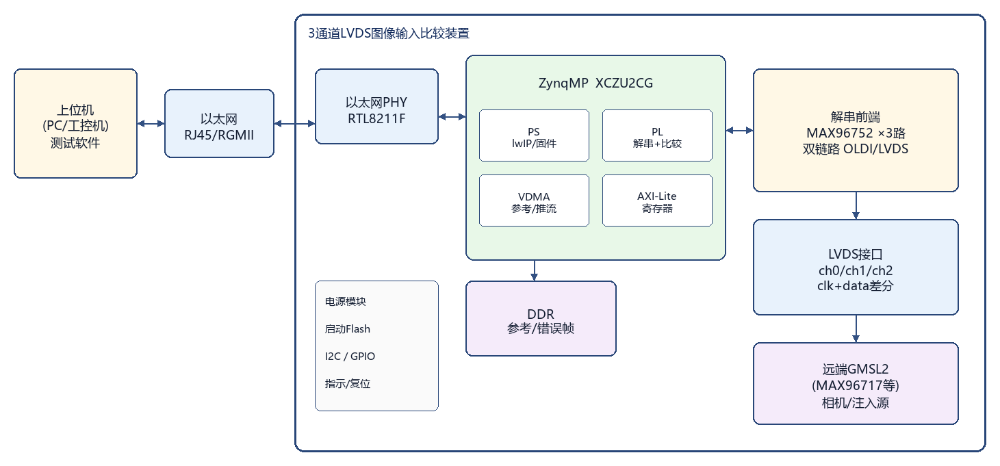
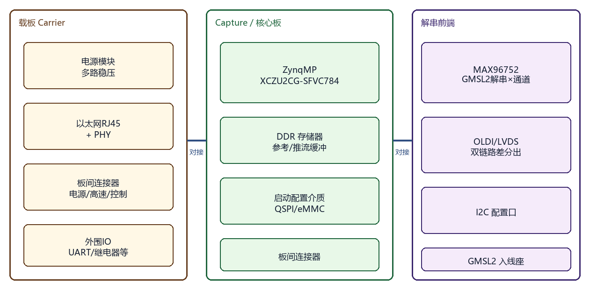
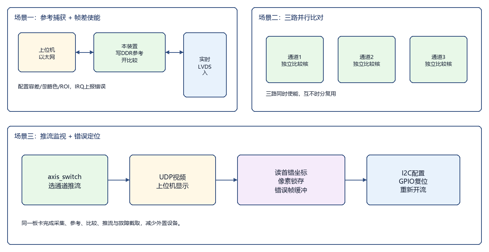

产品技术交底书

一、机构或装置的名称：

1553B 通讯卡
（亦可命名为：USB 接口双冗余 1553B 总线通讯卡、可配置 BC/RT/BM 的便携式 1553B 接口装置）

二、现有技术及其不足：

当前行业中，在航空电子、航天测控、武器系统及地面检测设备的联调与测试环节，已有若干种接入 MIL-STD-1553B（简称 1553B）数据总线的方案，主要包括以下几类：

基于 CPCI / PXI / PCI 插槽的 1553B 板卡
将 1553B 通讯板卡插入工控机或专用机箱的长条形总线插槽，由工控主机通过 PCI/PXI 总线访问板卡，完成总线控制器（BC）、远程终端（RT）、总线监视器（BM/MT）等功能。
常用形态：PXI 规格通讯板卡、CPCI 测试板、带 DDR 缓存的多通道板卡等。

基于专用协议芯片的分立模块
采用 1553B 协议专用芯片（如 B61580 一类）配合 DSP、CPLD 及收发器、隔离变压器，构成总线接口模块，再经并行总线或其它主机接口与系统相连。
常见组合：DSP + CPLD + 协议芯片 + 收发器。

商用 USB 转 1553B 适配器 / 线缆式模块
以 USB 线缆形态连接笔记本电脑或嵌入式主机，内部集成专用协议引擎与收发电路，提供 BC/RT/MT 驱动库，体积相对较小，但多为封闭方案，二次开发与裁剪空间有限。

现有技术不足：

体积与部署受限：CPCI、PXI、PCI 等插槽式板卡依赖专用机箱，插槽长、占用空间与重量大，不便在外场、便携工位或仅配备普通笔记本的场合使用。

方案构成复杂：传统“DSP + CPLD + 1553B 协议芯片”架构器件多、互连复杂、灵活性差，维护与国产替代成本高。

主机接口不统一：部分产品绑定 PXI/PCIe/DMA 体系，无法直接利用个人计算机上普及的 USB 接口实现即插即用。

协议处理过度依赖专用芯片：核心时序与模式切换封闭在专用协议芯片内部，难以在现场可编程器件内按项目需求同时集成 BC、RT、BM 及 1 Mbps / 4 Mbps 速率配置。

双冗余与角色配置不便：虽普遍标称 Bus A/B 双冗余，但通道选择、收发抑制、角色切换往往与封闭驱动深度绑定，硬件层面缺少清晰、可独立配置的模块化结构，不利于“一主多从”测试拓扑灵活搭建。

集成度与成本难以兼顾：高性能商用 USB 适配器价格高；低成本方案又常缺少完整的隔离耦合链路，或缺少片内消息缓冲与模式寄存器，难以同时满足实验室联调与小批量测试卡需求。

三、本发明的目的：

本发明旨在提供一种 1553B 通讯卡装置，使普通主机经 USB 即可接入双冗余 1553B 总线，并在同一硬件上通过模式配置工作于总线控制器、远程终端或总线监视器，从而完成协议通信、终端仿真与总线录波。主要目的是解决现有技术中体积大、插槽依赖强、方案构成复杂、专用芯片封闭、部署不便等问题。

具体而言，本发明的目的包括：

提供一种便携的 1553B 通讯硬件平台：主机侧 USB（FIFO 桥接），总线侧隔离变压器耦合的双冗余 Bus A / Bus B。

以 FPGA 为唯一核心处理单元，片内完成曼彻斯特编解码、BC/RT/BM 协议状态机与主机寄存器访问，无需再叠加 DSP、CPLD 与专用 1553B 协议芯片。

同一板卡通过 MODE 配置在 BC、RT、BM 之间互斥切换；多卡可组成“1×BC + N×RT + 可选 BM”实验室网络。

支持通道选择（CHSEL）、发送抑制/接收使能、重试换通道、双发及表决等双冗余策略，以及 1 Mbps / 4 Mbps 速率切换。

片内 Block RAM 提供 BC 暂存区、RT 子地址存储区与 BM 捕获区；板卡预留 DDR3 接口以便后续扩展大容量消息表，而不改变 USB 与 1553B 模拟前端结构。

通过核心板（数字）与底板（USB + 1553 模拟）模块化划分，降低改版与维护成本，便于批量配备于研发、检测与教学实训。

四、系统功能概述

1553B 通讯卡经 USB 与上位机连接。上位机通过带校验的帧协议读写卡内寄存器，配置工作模式、通道、速率与消息参数；FPGA 完成 1553B 协议处理与曼彻斯特编解码后，经 HI-1573 收发芯片与隔离变压器接入双冗余航空总线。

本装置可配置为：
总线控制器（BC）：主机填写命令字、字数与暂存数据后启动传输，卡完成发令、收状态、收数据、重试与块状态字记录；
远程终端（RT）：主机配置本机地址与子地址数据区后，卡自动应答匹配命令；
总线监视器（BM）：被动捕获总线上的字与时间信息，供主机读出分析。

系统同时支持 Bus A/B 通道策略与 1M/4M 速率配置，用于联调、终端替代、录波与冗余验证。

五、详细描述本发明的机构或装置：

1553B 通讯卡由 USB 接口、USB 桥接芯片、FPGA、配置存储器、晶振、电源模块、1553B 收发芯片、隔离变压器、1553B 总线接口、板间连接器组成；可选预留片外 DDR3 存储器接口。

总体结构见图1，核心板与底板划分见图2。

图1  1553B通讯卡总体结构框图

图2  核心板与底板模块划分示意图

本发明提供的一种 1553B 通讯卡，主要包括如下组成部分与功能模块：

（一）主机接口部分

USB 接口
采用 USB 插座，通过 USB 线缆与上位机对接，用于数据交互及（视供电设计）供电，实现即插即用。

USB 桥接芯片
采用 FT240XQ（或同功能 USB FIFO 桥片），将 USB 转换为 8 位并行 FIFO 接口（数据、读、写、空、满等握手信号），与 FPGA 字节级双向传输。FPGA 内主机桥逻辑对帧进行解析与 CRC 校验，将主机访问映射为卡内寄存器读写，无需片上处理器（无 MicroBlaze 等）。

（二）核心处理部分

现场可编程门阵列（FPGA）
采用 Xilinx Artix-7 系列器件（实施例：XC7A35T-2FGG484）。FPGA 作为唯一核心处理单元，内部功能模块见图3，主要包括：
主机接口与寄存器模块：模式、状态、命令字、字数、通道、速率、时序参数、固件版本等；
BC 模块：单条消息的发令、数据收发、应答等待、重试与块状态字（BSW）组装；数据经片内 scratch 缓冲与主机交换；
RT 模块：地址匹配、子地址（SA）存储区自动收发、状态字回送、矢量字/BIT 等常用方式码，以及 RT-RT 相关路径支持；
BM 模块：被动捕获消息字与微秒时间戳至片内环缓冲；
物理层与曼彻斯特编解码：系统时钟 50 MHz，片内倍频至 200 MHz 完成编码发送与双通道解码接收；
通道控制：CHSEL 选择 Bus A/B，驱动 TXINH、RXEN；可配置重试换通道、双发、表决接收；BM 模式下可对 A、B 同时解码。

图3  FPGA内部功能模块框图

配置存储器
采用 QSPI Flash，存放 FPGA 比特流，上电自动加载。

晶振
采用 50 MHz 石英晶振，为 FPGA 提供系统时钟。

片内缓冲与片外扩展
BC scratch：512×16；RT SA RAM：1024×16（32 子地址×每子地址最多 32 字）；BM 消息与时戳：各 512×16。均由片内 Block RAM 实现。
板卡预留 DDR3（16 位）接口，当前实现可不接存储控制器；后续扩展大容量消息调度表时无需改动 USB 与 1553 模拟前端。

（三）1553B 总线接口部分

1553B 收发芯片
采用 HI-1573（或同功能收发器）。实施例中一颗在用，提供芯片内 Bus A、Bus B 两路冗余收发；另一颗位号可硬件预留。FPGA 驱动差分收发脚及 TXINH、RXEN。

隔离变压器
分别耦合 A、B 通道，实现电气隔离，防止单点故障影响整网。

1553B 总线接口
对外引出双冗余 Bus A、Bus B 差分端子（或航空连接器）。

双冗余链路见图4。

图4  双冗余Bus A/B收发链路示意图

（四）电源与结构部分

电源模块
多路稳压，为 FPGA、Flash、USB 桥、收发芯片等供电。

机械结构
优选“核心板 + 底板”对接：核心板承载 FPGA、晶振、QSPI 及扩展连接器；底板承载 FT240、HI-1573、隔离变压器与总线接口。两板经高密度板间连接器互连。亦可做成单板一体化，功能划分保持不变。

主要器件选型（实施例）：
FPGA：Xilinx XC7A35T-2FGG484；
USB 桥：FTDI FT240XQ；
1553B 收发：Holt HI-1573；
隔离变压器：配套 1553B 脉冲变压器；
配置存储器：QSPI Flash；
晶振：50 MHz；
系统时钟组织：50 MHz → 片内 200 MHz（曼彻斯特）；速率寄存器选择 1 Mbps 或 4 Mbps。

六、工作方式：

本装置典型工作方式与组网关系见图5；BC 单消息在装置内部的数据路径见图6。

图5  典型工作方式与组网示意图

图6  BC单消息数据路径（装置内部数据流）

航电设备联调 / 总线控制器仿真
将通讯卡配置为 BC 模式（MODE=0），USB 连接上位机，1553B 接口接入被试设备或仿真总线。上位机经 USB 写入 scratch 数据、命令字与字数并启动传输；卡在总线上完成命令/数据发送、等待 RT 状态字、（读传输时）接收数据字，并将结果写回 scratch，同时更新状态寄存器与块状态字。主机先等待忙状态结束，再联合判定本条消息成败。

远程终端仿真 / 终端设备替代
将通讯卡配置为 RT 模式（MODE=1），设置本机 RT 地址并预置子地址数据区，使能 RT。卡挂接在 1553B 总线上，对匹配命令自动回送状态字及数据字，用于缺少真实机载终端时的协议联调或作为检测对端。普通 BC↔RT 联调时，RT 卡按常规终端配置；需要 RT-RT 消息时，再按配置开启相应路径。

总线监视录波 / 故障定位
将通讯卡配置为 BM 模式（MODE=2）并启动监视。卡被动侦听 Bus A/B 消息，将捕获字与时间戳缓存在片内，经 USB 供上位机读出，用于负载分析、异常定位与回归对比。BM 与 BC 发送不同时占用同一卡的工作角色（MODE 互斥）。

双冗余切换与速率配置验证
通过通道选择与收发控制在 Bus A、Bus B 间切换，或按策略双发、表决、重试换通道；通过速率配置在 1 Mbps 与 4 Mbps 间选择，完成冗余链路与速率适应性测试。

多卡组网测试
一块卡工作于 BC，若干卡工作于不同地址的 RT，可选再加一块 BM，共同挂接同一双冗余总线，搭建“一主多从 + 监视”实验室网络。注意：单卡在 BC 传输时片内 RT 不在同一总线上同时应答；BC↔RT 数据路径应使用多卡或对端真实设备。

七、本发明的有益效果：

与现有技术相比，本发明提供的 1553B 通讯卡在便携性、集成度、可配置性以及部署灵活性等方面具备显著优势：

1. 主机接口普及、部署便捷
采用 USB + FPGA + HI-1573 + 隔离变压器架构，无需 CPCI/PXI/PCI 专用机箱，普通笔记本即可接入，体积小、重量轻，适合实验室与外场。

2. 方案精简，降低对专用协议芯片叠加架构的依赖
FPGA 片内完成曼彻斯特编解码与 BC/RT/BM 协议逻辑，主机侧仅需 USB FIFO 桥接，无 DSP/CPLD/专用协议芯片叠加，器件少，利于降本与维护。

3. 一卡多角色，适配多种测试拓扑
同一硬件经 MODE 在 BC、RT、BM 间切换；多卡即可覆盖主从通信与监视录波，减少备件种类。

4. 双冗余结构完整，策略可配置
Bus A/B 经收发芯片与变压器对外引出，FPGA 统一管理通道选择、收发使能及重试换通道等，便于冗余与故障隔离验证。

5. 速率可配置，兼顾标准与扩展测试
支持 1 Mbps 与 4 Mbps，满足标准 1553B 应用并便于更高带宽联调。

6. 缓冲分区清晰，可平滑扩展
片内 BRAM 分区服务于 BC/RT/BM；预留 DDR3 接口，扩展消息表时无需改动模拟前端。

7. 模块化结构，利于改版与量产
核心数字与 USB/1553 模拟前端分板，接口标准、功能可配置，适合研发、检测与教学实训规模化配备。

八、技术关键点与欲保护点（供代理人提炼权利要求）

1. 一种 1553B 通讯卡，包括依次连接的 USB 接口、USB 桥接芯片、FPGA、1553B 收发芯片、隔离变压器及双冗余 1553B 总线接口。

2. 所述 FPGA 内配置有主机接口逻辑、曼彻斯特编解码逻辑，以及可互斥切换的总线控制器逻辑、远程终端逻辑与总线监视器逻辑；并配置有分别服务于上述三者的片内缓冲存储区。

3. 所述 1553B 收发芯片与隔离变压器构成 Bus A、Bus B 双冗余通道，FPGA 输出通道选择及发送抑制、接收使能信号，并可配置重试换通道。

4. 所述通讯卡采用核心板与底板对接结构：核心板承载 FPGA 与配置电路，底板承载 USB 桥接与 1553B 模拟前端。

5. 所述通讯卡支持 1 Mbps / 4 Mbps 速率配置，并预留片外存储器扩展接口。

6. 所述 USB 桥接芯片为并行 FIFO 型桥片，FPGA 以寄存器访问方式与上位机交互，无需片上处理器核。

九、附图说明

图1：1553B 通讯卡总体结构框图（见上文插图）。
图2：核心板与底板模块划分示意图。
图3：FPGA 内部功能模块框图（MODE 互斥、BC/RT/BM、PHY、缓冲）。
图4：双冗余 Bus A/B 收发链路示意图。
图5：典型工作方式与组网示意图（BC 联调、RT 仿真、多卡组网）。
图6：BC 单消息数据路径（装置内部数据流）。

附图源文件目录：`文件/figures/`（fig1_overall.png … fig6_datapath.png）。如代理人需要 CAD/Visio 矢量图，可按上述框图重绘。

说明：实用新型专利保护产品的形状、构造或其结合。正式申请文本请以“连接关系 + 模块组成 + 工作方式”为主；发明人、申请人信息请另行填写。

（以下为内部对照，可不提交代理人）
对应工程：FK-USB-1553B 底板（FT240 + HI-1573）+ XC7A35T 核心板，RTL 顶层 mil1553b_top；功能基线见工程文档 BASELINE / HARDWARE_ARCHITECTURE / to_soft。交底书风格对齐《技术交底书-相机视频注入盒》。
